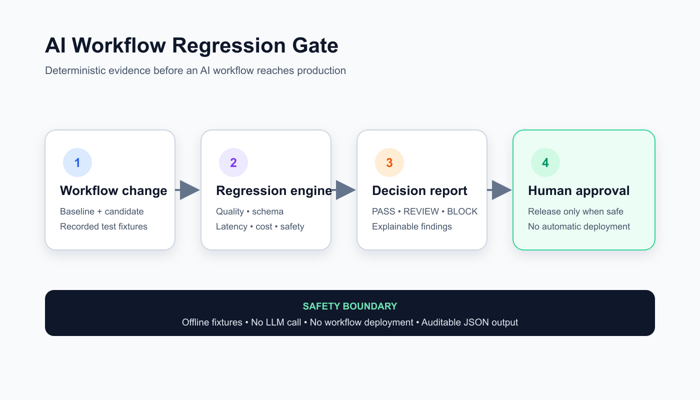

# AI Workflow Regression Gate

AI and n8n workflows can appear correct in a demo while quietly regressing after a prompt, model, tool, or routing change. This project turns recorded workflow runs into a deterministic release decision before anything is deployed.



## What it does

- Compares baseline and candidate output quality using explicit expected terms.
- detects forbidden content and required-schema regressions.
- measures latency and cost increases against configurable thresholds.
- returns an explainable `PASS`, `REVIEW`, or `BLOCK` decision.
- evaluates offline fixtures only: it calls no model and deploys no workflow.
- keeps a human approval gate for every non-passing result.

## Architecture

1. A proposed workflow change supplies recorded baseline and candidate fixtures.
2. The deterministic engine checks quality, schema, latency, cost, and forbidden content.
3. An auditable JSON report explains every regression.
4. n8n releases only passing changes; all others require human review.

## Run locally

```bash
PYTHONPATH=src python -m ai_workflow_regression_gate examples/regression-suite.json
```

The included example intentionally returns `REVIEW`, so the command exits with status `1`. That is useful in CI: a risky change fails the gate.

Run the tests:

```bash
PYTHONPATH=src python -m unittest discover -s tests -v
```

Install the command:

```bash
python -m pip install .
ai-workflow-regression-gate examples/regression-suite.json
```

## Docker

```bash
docker build -t ai-workflow-regression-gate .
docker run --rm \
  -v "$PWD/examples:/data:ro" \
  ai-workflow-regression-gate /data/regression-suite.json
```

## Input contract

Each case contains explicit expected and forbidden terms plus recorded baseline and candidate runs:

```json
{
  "id": "incident-summary",
  "expected_terms": ["database", "rollback"],
  "forbidden_terms": ["password"],
  "baseline": {
    "output": "Database latency; recommend rollback.",
    "latency_ms": 1180,
    "cost_usd": 0.024,
    "schema_keys": ["answer", "confidence"]
  },
  "candidate": {
    "output": "Database latency; recommend rollback.",
    "latency_ms": 1510,
    "cost_usd": 0.031,
    "schema_keys": ["answer"]
  }
}
```

The engine fails closed on malformed input and duplicate case IDs.

## n8n integration

Import `n8n/regression-gate-workflow.json` into a self-hosted n8n instance where this package is installed. The workflow:

- accepts a suite through a webhook;
- runs the offline evaluator;
- routes `PASS` to approval;
- routes `REVIEW` and `BLOCK` to human review.

The workflow is inactive by default. Inspect its command node and authentication before enabling it.

## Safe deployment guidance

- Keep production prompts, customer data, API keys, and secrets out of fixtures.
- Use synthetic or properly redacted test cases.
- Pin the container digest in CI.
- Protect release branches and require the regression report as a status check.
- Treat thresholds as version-controlled policy.
- Preserve the human approval boundary for `REVIEW` and `BLOCK`.

This repository performs no production mutation and includes no infrastructure provisioning.

## Why this matters

The project demonstrates practical AI orchestration: model-independent testing, deterministic evaluation, safe automation, n8n integration, CI/CD gating, observability signals, and human-in-the-loop control.

## License

MIT

